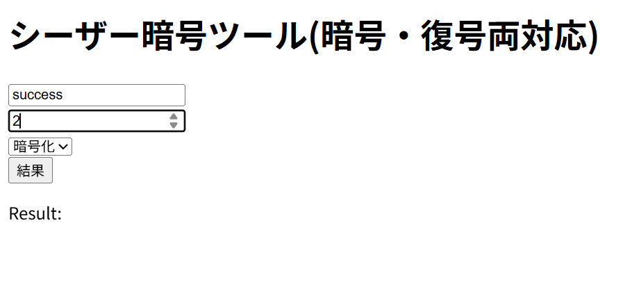
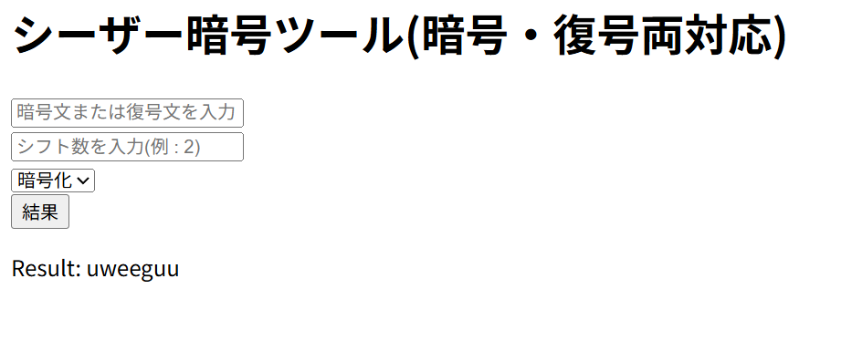

# シーザー暗号ツール

## 概要
シーザー暗号の暗号化・復号化をPythonで行うツール

## 作ろうと思った理由
授業で学んだ内容をもとに、実際に自分でプログラムを作成することで理解を深めたいと考えたためである。

また、単にコードを書くことにとどまらず、GitHubでの公開やREADMEの作成まで含めて行うことで、小規模ながら実際の開発に近い一連の流れを体験することも目的とした。

さらに、古典暗号の仕組みを実装することで、暗号の基本的な考え方を体験的に学ぶことを目指した。

## 特徴および工夫した点
- 暗号化・復号化処理、文字の変換、モード適用(暗号化・復号化)を別の関数に分けることで、処理の確認をしやすくし、コードを見やすくした
- 入力された文字を1文字ずつ処理することで、シンプルな構造で実装した
- 暗号化か復号化かでシフト数をそのまま渡すか負の値で渡すかを決め、内容が重複しないようにした

## 使い方
> [!WARNING]
テキスト入力欄にアルファベット以外を入力すると、正しく暗号化・復号されません!

### CLI版
以下のコマンドを実行する<br>
```
python main.py
```
実行後、平文とシフト数を入力することで暗号化および復号ができる

### Web版
以下のコマンドを実行する<br>
```
python app.py
```
その後、ブラウザで以下にアクセス<br>
<http://127.0.0.1.5000><br>
文とシフト数を入力し、モードを選択することで結果が表示される

## Web版について
CLI版が完成後、Web上で動作するようにしたいと考え、Flaskを用いてCLI版と同じ処理ができるようにした

## 実行画面
入力画面↓

結果画面↓


## 今回の学び
- 関数を処理ごとに分けることで、可読性を上げられるとともに、テストがしやすくなることが分かった
- GitHubを用いたコード管理の基礎と、READMEに関連する知識を学んだ
- GitHubなどは、とても難しいものではないということを理解した

## 今後の展望
- 誤った入力に対する処理の追加
- 他の暗号(ビジュネル暗号など)の実装